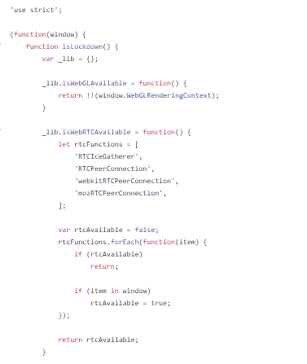

# Trying to undestand a "remote" lockdown detection in iphone

I was reading about the old CIA7 vault leak. And there was an  capability that claimed that it came with remote arhitecture detection.  This lead me down the rabbit hole. Moreover I was also looking over the hacking team old leaks. And soon will come another article about some malware from that. Anyways even more temptation and i went down the rabbit hole and found about browser fingerprinting and what nah. And i guess of frustration or idk what , pure interest of stuff i wanted to document this thing, cause it seemed interesting.

So i have to mention that i borrowed the code from [https://github.com/botherder/is-lockdown/](https://github.com/botherder/is-lockdown/)

Main logic is in is-lockdown.js

<figure><figcaption></figcaption></figure>

Cool so tl;dr we check to see is we have webgl api avaiable and to see if rtc is on. Why  tho ? Well the first thing that popped in my head was wegl canvar fingerprinting. Coincidently enough when i searched on this topic(iphone lockdown) if anyone did some prev research turns out they did. Someone that goes by the name of Alexis Lours and who's more entitled to talk about web stuff than I am states: "WebGL fingerprinting is one of the oldest way to track users through “unconventional” methods with rendering discrepancies between individual devices, even running the same hardware. The `WebGLRenderingContext` can also be used to detect user hardware and support WebGL versions."

Now what about the rtc ?

Well the same individual states that: "The WebRTC API can be used to leak the public and local IP of a device, even under a VPN, when communicating with a STUN server" . And to this i guess the best argument we have is the NATslip from Samy Kamkar(sorry if i messed up his name). I will document later about more possible attach after i have had enough wish to do more research.

Now the overall logic of the code at least for the rtc check is that we have some predifined rtc functions which initiate a rtc connection and than we check to see if they are available in the current window(one might add if they are current in the current renderer).

Next we check to see if mathml is present ? why ? Apparently it can be used to track a device through the `DOMRect` object of a MathML render.

Ok and how do we check to see if the mathmlapi is there ? well apparently we go to stackoverflow and copy paste some code :)

([https://stackoverflow.com/questions/4827044/how-to-detect-mathml-tag-support-mfrac-mtable-from-javascript](https://stackoverflow.com/questions/4827044/how-to-detect-mathml-tag-support-mfrac-mtable-from-javascript))(With window.getComputedStyle method)

And what this boils down is basically a div with red color property checked against native rgb api call.

<figure><figcaption></figcaption></figure>

Finally we check for the user agent to see if it's an iphone and to get it's version.Lastly we call all these functions an return a true or false based on these functions. true is lockedown mode on else false.

.png>)

This is how it looks in action:

<figure><figcaption></figcaption></figure>

The end. I know that this was somewhat short article but I'm not into best physical shape unf :/ and also mentally. So take it as a trying to get back into buz attempt. Aslo a final word: this can deffno be improved more with many more test such i will add addition material to read :smile:























{% embed url="https://github.com/prescience-data/dark-knowledge/blob/main/pdf/2021%20-%20OS%20Fingerprinting%20and%20Tethering%20Detection%20in%20Mobile%20Networks.pdf" %}


